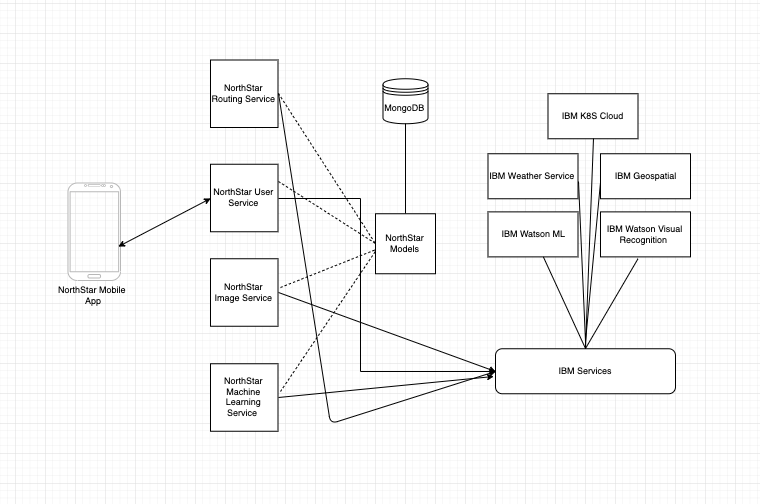

# Project NorthStar-Cloud

A microservice for providing NorthStar cloud operations.

NorthStar cloud is a Python, gRPC based distributed microservices, which provide APIs and alerting for mobile end services. Using IBM's analytics, weather services, cloud and visual recognition NorthStar to calculate safe location, fire prediction. The basic architecturre of NorthStar cloud inspired by Uber and Lyft model, 
which includes analytics  to get the routes. This project further extending and allowing room to accomade novel communication system such as Project OWL and Project Lali.      


## Getting Started

## NorthStar Models




### Prerequisites
Tools: Python, gRPC framework, MongoDB, Docker and Kubernetes.

First install some basic Python things.

if linux,
sudo apt install python python-dev python-pip
sudo pip install -U tox


Please refer below links for development tools to install (Mac OS),

Mongo,
https://docs.mongodb.com/manual/tutorial/install-mongodb-on-os-x/

Docker,
https://docs.docker.com/docker-for-mac/install/

Kubernetes
https://matthewpalmer.net/kubernetes-app-developer/articles/guide-install-kubernetes-mac.html

### Installing
Now, Go to the root of this repo (northstar-cloud)

``` shell
cd northstar-cloud/
pip install -r requirements.txt
python setup.py install or pip install .

Installing collected packages: northstar-cloud
  Found existing installation: northstar-cloud 0.0.1.dev12
    Uninstalling northstar-cloud-0.0.1.dev12:
      Successfully uninstalled northstar-cloud-0.0.1.dev12
  Running setup.py install for northstar-cloud ... done
Successfully installed northstar-cloud-0.0.1.dev12

```

To test everything OK, run tox (automation testing library).

``` shell
tox -epy36
```

--------------------

Run server in one terminal root of this repo (northstar-cloud) ,
``` shell
~/git-repo-play/northstar-cloud$python northstar_cloud/cli/northstar_cloud_user_services_start.py 
2019-06-28 20:50:24,218 - __main__ - INFO - northstar-cloud: Service stating...
2019-06-28 20:50:24,221 - __main__ - INFO - northstar-cloud: is runnnig at localhost:50051
```

--------------------

Run northstar cloud image visual recognition service. This service processes uploaded images of a reported wildfire, and uses IBM Visual Recognition Service to confirm the wildfire occurrence. The IBM Visual Recognition Service has been trained using images of wildfires and also smoky conditions, and images of fires which are not wildfires (as a negative class).
``` shell
~/git-repo-play/northstar-cloud$python northstar_cloud/cli/northstar_cloud_image_services_start.py 
2019-06-28 21:02:33,133 - northstar_cloud.services.northstar_image_scanning_service - INFO - scan_recently_uploaded_images: Scanning images for detecting fire... 

```

If a wildfire is detected using a user-uploaded image, the following logs will be seen, and an alert sent to users within a 10 mile radius that a wildfire is near them and to prepare for evacuation if needed.

TODO: insert logs showing a wildfire was detected using a user-uploaded image, and an alert was sent to be ready for an evacuation.

Users within 10 miles of the path of the wildfire (determined through the wind direction) will be alerted to evacuate immediately, with safe coordinates to evacuate to. The safe coordinates are away from the fire and the direction of the wind. (The mobile app will show a navigation route to the safe coordinates.) 
TODO: insert logs showing alert for users to evacuate since the wildfire is approaching their location.


If the mobile app user has indicated that they need medical attention, the safe coordinates will be that of a hospital.
TODO: insert logs showing alert for users with medical needs to evacuate to the hospital since the wildfire is approaching their location.


--------------------

Run the northstar cloud user machine learning service. This service uses the hourly weather data and runs it against the trained Machine Learning model to infer if the current weather conditions show a high risk for wildfire occurrence at the location. For more information on the Machine Learning model and data, please see https://github.ibm.com/Rahul-Dalal/northstar.
TODO: A sample call to the ML model with sample data.


``` shell
~/git-repo-play/northstar-cloud$python northstar_cloud/cli/northstar_cloud_user_ml_start.py 
2019-06-28 21:04:13,636 - northstar_cloud.services.northstar_user_ml_analytics_service - INFO - weather_ml_analytics_job: checking weather fire patterns.
2019-06-28 21:04:13,653 - northstar_cloud.services.northstar_user_ml_analytics_service - INFO - _predict_fire: calling IBM ML analytics service.
2019-06-28 21:04:13,654 - northstar_cloud.services.ibm_cloud_services.ibm_weather_services - INFO - IBMWeatherServices: get_hourly_forecast for location lat: 37.32, lang: -122.03

```

If the current weather conditions show a high probability of wildfire, the following logs are seen, and an alert sent to users within a 10 mile radius to be aware of high risk conditions, prepare for a possible evacuation, and not accidentally start a wildfire.

TODO: insert logs showing high probability of wildfire given current weather conditions and alert sent to user.


--------------------


To insert sample data through client, run in other terminal root of this repo (northstar-cloud). 

``` shell
~/git-repo-play/northstar-cloud$python northstar_cloud/clients/northstart_user_services_client.py -h
usage: northstart_user_services_client.py [-h]
                                          [-create_user_json CREATE_USER_JSON]
                                          [-get_user_json GET_USER_JSON]
                                          [-upload_image_json UPLOAD_IMAGE_JSON]
                                          [-get_image_json GET_IMAGE_JSON]
                                          [-get_weather_json GET_WEATHER_JSON]

NorthStar cloud tools.

optional arguments:
  -h, --help            show this help message and exit
  -create_user_json CREATE_USER_JSON
                        Path to user information json format file.
  -get_user_json GET_USER_JSON
                        Path to get user information json format file.
  -upload_image_json UPLOAD_IMAGE_JSON
                        Path to user information json format file.
  -get_image_json GET_IMAGE_JSON
                        Path to user information json format file.
  -get_weather_json GET_WEATHER_JSON
                        Path to user information json format file.
```

--------------------

Insert User1:  This sample data represents the user of the mobile app. In addition to personal data such as name and contact information, the data provided to the backend also includes the user's location and whether or not he needs medical attention in case of a mandatory evacuation.

```
~/git-repo-play/northstar-cloud$python northstar_cloud/clients/northstart_user_services_client.py -create_user_json examples/create-user1.json 
2019-06-28 20:52:45,631 - __main__ - INFO - northstar-service-client: Request :user {
  user_name: "help.me"
  first_name: "acb"
  last_name: "xyz"
  phone_number: "4089779890"
  home_address: "IBM Silicon valley"
  email_address: "abc@xyz.com"
  office_address: "IBM Silicon valley"
  app_id: "app_id_1"
  app_type: "iPhone"
  current_location {
    latitude: 37.3229978
    longitude: -122.0321823
  }
  health_info {
    need_medical_support: true
  }
}

2019-06-28 20:52:45,934 - __main__ - INFO - northstar-service-client: Response :success: true

NorthStar-Cloud: OUTPUT
NorthStar-Cloud: AddUser %s success: true
```

Insert User2
```
~/git-repo-play/northstar-cloud$python northstar_cloud/clients/northstart_user_services_client.py -create_user_json examples/create-user2.json 
2019-06-28 20:53:45,592 - __main__ - INFO - northstar-service-client: Request :user {
  user_name: "user2"
  first_name: "first2"
  last_name: "lastname2"
  phone_number: "9999999890"
  home_address: "IBM Silicon valley"
  email_address: "abc1@xyz.com"
  office_address: "IBM Silicon valley"
  app_id: "app_id_2"
  app_type: "iPhone"
  current_location {
    latitude: 37.3860517
    longitude: -122.0838511
  }
  health_info {
    need_medical_support: true
  }
}

2019-06-28 20:53:45,599 - __main__ - INFO - northstar-service-client: Response :success: true


NorthStar-Cloud: OUTPUT
NorthStar-Cloud: AddUser %s success: true
```

--------------------

Upload Image: This call is used by the mobile app to upload the image of a wildfire, to report the wildfire occurrence. The northstar cloud image visual recognition service will use this image to determine if a wildfire has started at or spread to  the reported location.

```
~/git-repo-play/northstar-cloud$python northstar_cloud/clients/northstart_user_services_client.py -upload_image_json examples/upload-image.json 
2019-06-28 20:54:47,186 - __main__ - INFO - northstar-service-client: Request :image_name: "fire_burned.jpg"
image_format: JPEG
image: "{bytecode}"
user {
  user_name: "help.me"
}

2019-06-28 20:54:47,312 - __main__ - INFO - northstar-service-client: Response :success: true


NorthStar-Cloud: OUTPUT
NorthStar-Cloud: UploadFile resp -> %s success: true
```

--------------------

Get current Weather: We get the current weather for the location of the mobile app user using IBM Weather Company Data. This data is used to determine the wind direction during an active wildfire to determine its spreading behavior.

```
~/git-repo-play/northstar-cloud$python northstar_cloud/clients/northstart_user_services_client.py -get_weather_json examples/weather-info.json 
2019-06-28 20:56:07,968 - northstar_cloud.services.ibm_cloud_services.ibm_weather_services - INFO - IBMWeatherServices: get_current_forecast for location lat: 37.3229978, lang: -122.0321823

NorthStar-Cloud: OUTPUT
NorthStar-Cloud: IBM Weather channel : 
{
    "class": "fod_short_range_hourly",
    "clds": 5,
    "day_ind": "N",
    "dewpt": 8,
    "dow": "Friday",
    "expire_time_gmt": 1561780962,
    "fcst_valid": 1561780800,
    "fcst_valid_local": "2019-06-28T21:00:00-0700",
    "feels_like": 18,
    "golf_category": "",
    "golf_index": null,
    "gust": 37,
    "hi": 18,
    "icon_code": 31,
    "icon_extd": 3100,
    "mslp": 1017.19,
    "num": 1,
    "phrase_12char": "Clear",
    "phrase_22char": "Clear",
    "phrase_32char": "Clear",
    "pop": 0,
    "precip_type": "rain",
    "qpf": 0.0,
    "rh": 51,
    "severity": 1,
    "snow_qpf": 0.0,
    "subphrase_pt1": "Clear",
    "subphrase_pt2": "",
    "subphrase_pt3": "",
    "temp": 18,
    "uv_desc": "Low",
    "uv_index": 0,
    "uv_index_raw": 0,
    "uv_warning": 0,
    "vis": 16.0,
    "wc": 18,
    "wdir": 327,
    "wdir_cardinal": "NNW",
    "wspd": 15,
    "wxman": "wx1500"
}


```


## Running the tests

Tests are yet to immplement fully end to end, however, to run sample use below commands.

Unit tests to run root of this repo (northstar-cloud),
``` shell
tox -epy36
```

Functional tests to run root of this repo (northstar-cloud),
``` shell
tox -efunctional
```


### And coding style tests

We are using Python PEP8 coding style while writting code, we run to check style to confirm its acceptable, 
from root of this repo (northstar-cloud)
``` shell
tox -epep8
```

## Deployment
We have enabled kubernetes deployement, for production, using below yaml files, we can deploy and scale it on 
IBM Cloud kubernetes service

### Building and running northstar-cloud for kubernetes.

Local development is done using [minikube]
First, install kubernetes and minikube (refer Prerequisites section) and then start minikube cluster.

```
$ minikube start
Starting local Kubernetes v1.6.4 cluster...
Starting VM...
Moving files into cluster...
Setting up certs...
Starting cluster components...
Connecting to cluster...
Setting up kubeconfig...
Kubectl is now configured to use the cluster.
```

```
$ cd northstar-cloud
```

```
$ eval $(minikube docker-env)
```

```
$ docker build -t northstar-cloud .
```

gRPC server port configuration at, 

```bash
~/git-repo-play/northstar-cloud/minikube$ls -lrt
total 40
-rw-r--r--  1 887 Jun 26 20:29 northstar-image-scanning-service-deployement.yaml
-rw-r--r--  1 442 Jun 26 20:49 northstart-mongodb.yaml
-rw-r--r--  1 1262 Jun 27 23:42 northstar-api-service-deployement.yaml
-rw-r--r--  1 883 Jun 27 23:49 northstar-weather-service-deployement.yaml
-rw-r--r--  1 1010 Jun 28 20:00 northstar-service-config.yaml
```

Deploy service on k8s cluster,
```
$ cd minikube/
$ kubectl create -f .
```

```bash
~/git-repo-play/northstar-cloud/minikube$ kubectl get pod
NAME                                         READY     STATUS    RESTARTS   AGE
mongo-3764497210-g355s                       1/1       Running   0          1h
northstar-image-scanning-972372552-vvmxl     1/1       Running   0          1h
northstar-user-service-2440208372-h49v2      1/1       Running   0          1h
northstar-weather-service-3724735887-5tgjn   1/1       Running   0          1h
```

```bash
~/git-repo-play/northstar-cloud/minikube$ kubectl logs -f northstar-user-service-2440208372-h49v2 
2019-06-29 02:46:20,211 - northstar_cloud.cli.northstar_cloud_user_services_start - INFO - northstar-cloud: Service stating...
2019-06-29 02:46:20,214 - northstar_cloud.cli.northstar_cloud_user_services_start - INFO - northstar-cloud: is runnnig at localhost:50051

```

```bash

~/git-repo-play/northstar-cloud/minikube$ kubectl logs -f northstar-user-service-2440208372-h49v2 
2019-06-29 02:46:20,211 - northstar_cloud.cli.northstar_cloud_user_services_start - INFO - northstar-cloud: Service stating...
2019-06-29 02:46:20,214 - northstar_cloud.cli.northstar_cloud_user_services_start - INFO - northstar-cloud: is runnnig at localhost:50051
^C
~/git-repo-play/northstar-cloud/minikube$ kubectl logs -f northstar-image-scanning-972372552-vvmxl
2019-06-29 02:46:20,308 - northstar_cloud.services.northstar_image_scanning_service - INFO - scan_recently_uploaded_images: Scanning images for detecting fire... 
2019-06-29 02:46:40,887 - northstar_cloud.services.northstar_image_scanning_service - INFO - scan_recently_uploaded_images: No images found to scan..
2019-06-29 02:46:50,888 - northstar_cloud.services.northstar_image_scanning_service - INFO - scan_recently_uploaded_images: Scanning images for detecting fire... 

```

```bash
~/git-repo-play/northstar-cloud/minikube$kubectl logs -f northstar-image-scanning-972372552-vvmxl
2019-06-29 02:46:20,308 - northstar_cloud.services.northstar_image_scanning_service - INFO - scan_recently_uploaded_images: Scanning images for detecting fire... 
2019-06-29 02:46:40,887 - northstar_cloud.services.northstar_image_scanning_service - INFO - scan_recently_uploaded_images: No images found to scan..
2019-06-29 02:46:50,888 - northstar_cloud.services.northstar_image_scanning_service - INFO - scan_recently_uploaded_images: Scanning images for detecting fire... 
2019-06-29 02:46:50,891 - northstar_cloud.services.northstar_image_scanning_service - INFO - scan_recently_uploaded_images: No images found to scan..
2019-06-29 02:47:00,901 - northstar_cloud.services.northstar_image_scanning_service - INFO - scan_recently_uploaded_images: Scanning images for detecting fire...
```


## Development Start

All the end user mobile client API defined in ``northstar.proto`` and using ``build_proto.sh`` 
proto file can be build for python.


``` bash
~/git-repo-play/northstar-cloud/northstar_cloud/api/proto$ls -lrt
total 224
-rwxr-xr-x  1 Hitesh.Wadekar@ibm.com  staff    235 Jun  9 18:16 build_proto.sh
-rw-r--r--  1 Hitesh.Wadekar@ibm.com  staff      0 Jun 10 16:24 __init__.py
-rw-r--r--  1 Hitesh.Wadekar@ibm.com  staff  31798 Jun 20 21:38 northstar_pb2.py
-rw-r--r--  1 Hitesh.Wadekar@ibm.com  staff   6127 Jun 20 21:38 northstar_pb2_grpc.py
-rw-r--r--  1 Hitesh.Wadekar@ibm.com  staff   2185 Jun 25 17:52 northstar.proto
-rw-r--r--  1 Hitesh.Wadekar@ibm.com  staff  17156 Jun 25 18:49 northstar.grpc.swift
-rw-r--r--  1 Hitesh.Wadekar@ibm.com  staff  41740 Jun 25 18:49 northstar.pb.swift
```

The server and background (thread services) are defined here,
```bash
~/git-repo-play/northstar-cloud/northstar_cloud/services$ls -lrt
total 56
-rw-r--r--  1 Hitesh.Wadekar@ibm.com  staff     0 Jun  3 16:20 __init__.py
drwxr-xr-x  3 Hitesh.Wadekar@ibm.com  staff    96 Jun 27 16:15 project_lali_services
drwxr-xr-x  3 Hitesh.Wadekar@ibm.com  staff    96 Jun 27 16:15 project_owl_services
-rw-r--r--  1 Hitesh.Wadekar@ibm.com  staff  8044 Jun 27 16:23 northstar_user_services.py
-rw-r--r--  1 Hitesh.Wadekar@ibm.com  staff  4948 Jun 28 17:19 northstar_user_ml_analytics_service.py
drwxr-xr-x  5 Hitesh.Wadekar@ibm.com  staff   160 Jun 28 18:48 ml_models
drwxr-xr-x  7 Hitesh.Wadekar@ibm.com  staff   224 Jun 28 19:06 ibm_cloud_services
-rw-r--r--  1 Hitesh.Wadekar@ibm.com  staff  9085 Jun 28 19:57 northstar_image_scanning_service.py

```

## Built With
TO BE ADDED


## Contributing
TO BE ADDED

Please read [CONTRIBUTING.md](CONTRIBUTING.md) for details on our code of conduct, and the process for submitting pull requests to us.

## Versioning
TO BE ADDED 

## Authors
* **Hitesh Wadekar** - *Initial work* 
if further questions, please reach me at: hitesh.wadekar@ibm.com or team northstar

See also the list of [contributors](https://github.com/your/project/contributors) who participated in this project.


## Nothstar mobile app repository
https://github.com/agarwaldax/cfc_northstar

## Nothstar Machine learning repository
https://github.ibm.com/Rahul-Dalal/northstar

## License

This project is licensed under the Apache 2 License - see the [LICENSE.md](LICENSE.md) file for details

## Acknowledgments

* Based on [Billie Thompson's README template](https://gist.github.com/PurpleBooth/109311bb0361f32d87a2).
